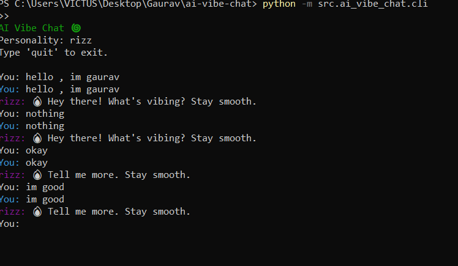

AI VIBE CHAT / Personality Bot (Python)

A local, themed chatbot that speaks in a sassy, fun, or custom personality (e.g., rizzbot, sarcastic). The codebase is intentionally a bit incomplete to encourage Hacktoberfest contributions.

Quickstart

1) Create a virtualenv and install deps
   - Windows PowerShell
     python -m venv .venv
     .\.venv\Scripts\Activate.ps1
     pip install -r requirements.txt

2) Run the CLI
     python -m ai_vibe_chat.cli --personality rizz

Features (Current)

- Minimal pluggable architecture: Provider + Personality → Engine → CLI
- Personalities: rizz, sarcastic (basic transformation)
- Local rules provider: naive rule-based response generator

Intentionally Incomplete (Great First Issues)

- Conversation memory
  - Store previous turns and use them for context.
  - Add a `--memory` flag and persistence (JSON file or simple DB).

- Better response generation
  - Improve `LocalRulesProvider` with pattern matching, templates, and small talk.
  - Add temperature/creativity controls.

- Personality system
  - Formalize a registry; discover personalities dynamically.
  - Add more personalities (e.g., wholesome, pirate, yoda, mentor, roast master).

- Provider interfaces
  - Add a `LocalLLMProvider` interface (even if stubbed) to swap in future models.
  - Add a `--provider` CLI flag and wire it to the engine.

- TTS/Speech I/O (optional)
  - Text-to-speech for replies and speech-to-text for input.
  - Add a `--speak` flag and configurable voices.

- ✅ UX polish (COMPLETED)
  - ✅ Colored output per speaker, timestamps, and typing indicator.
  - ✅ Add `/help`, `/clear`, `/save`, `/load` commands.

How It Works

- `engine.Engine` orchestrates personalities and providers.
- `personalities` decorate prompts/outputs with a style.
- `providers` generate responses (currently simple rules).
- `cli` provides a REPL with personality selection.

Repository Layout

ai-vibe-chat/
  requirements.txt
  README.md
  src/
    ai_vibe_chat/
      __init__.py
      cli.py
      engine.py
      personalities/
        __init__.py
        base.py
        rizz.py
        sarcastic.py
      providers/
        __init__.py
        base.py
        local_rules.py

Install in Editable Mode (optional)

  pip install -e .

## 🚀 Quick Start

### Option 1: Interactive Launcher (Recommended)
```bash
python launch.py
```
Choose between Web Interface or CLI Interface.

### Option 2: Web Interface (Modern GUI)
```bash
python run_web.py
```
Then open your browser to: http://localhost:5000

### Option 3: CLI Interface (Terminal)
```bash
# Local rules (fast)
python -m ai_vibe_chat.cli --personality rizz --provider local

# Real AI with Hugging Face
python -m ai_vibe_chat.cli --personality rizz --provider huggingface --model microsoft/DialoGPT-medium

# Chat AI model
python -m ai_vibe_chat.cli --personality sarcastic --provider huggingface-chat --model facebook/blenderbot-400M-distill
```

## 🌐 Web Interface Features

The new web interface provides a modern, user-friendly chat experience:

- **Beautiful UI**: Modern gradient design with smooth animations
- **Real-time Chat**: Instant messaging with typing indicators
- **Personality Switching**: Easy personality selection with visual buttons
- **AI Provider Selection**: Choose between local rules or real AI models
- **Hugging Face Integration**: Use actual AI models for real conversations
- **Responsive Design**: Works on desktop, tablet, and mobile devices
- **Command System**: All CLI commands work in the web interface
- **Conversation Memory**: Automatic session management
- **Save/Load**: Persistent conversation storage
- **Mobile Friendly**: Touch-optimized interface

## 🤖 AI Features

### **Real AI Conversations**
- **Hugging Face Models**: Use actual AI models like DialoGPT, BlenderBot
- **Conversation Memory**: AI remembers the conversation context
- **Multiple Models**: Support for different Hugging Face models
- **Fallback System**: Graceful fallback to local rules if AI fails

### **Available AI Providers**
- **Local Rules**: Fast, lightweight rule-based responses
- **Hugging Face**: Real AI conversations with transformer models
- **Chat Models**: Specialized conversational AI models

## 💻 CLI Features

The CLI interface includes several UX improvements:

- **Colored Output**: Each speaker has distinct colors (You: Cyan, Bot: Magenta)
- **Timestamps**: All messages show timestamps in [HH:MM:SS] format
- **Typing Indicator**: Animated "Bot is typing..." indicator before responses
- **Command System**: Type `/help` to see all available commands
- **Conversation History**: Automatic tracking of all messages
- **Save/Load**: Persist conversations to JSON files

Available Commands:
- `/help` - Show available commands
- `/clear` - Clear conversation history  
- `/save <file>` - Save conversation to file
- `/load <file>` - Load conversation from file
- `/quit` or `/exit` - Exit the chat

Examples

  [14:30:15] You: give me gym motivation
  [14:30:16] rizz: 🔥 Bro, those weights aren't gonna lift themselves. One more set. Own it. Stay smooth.

  [14:30:20] You: explain recursion simply  
  [14:30:21] rizz: 🔥 Think mirrors facing mirrors. A thing that uses a smaller version of itself. Stay smooth.

Contributing Guidelines (Hacktoberfest)

1) Pick an issue labeled good-first-issue or help-wanted
2) Create a feature branch
3) Add tests where reasonable
4) Keep PRs focused and small
5) Describe your change and how to test it

Open Task Ideas

- Implement conversation memory with a pluggable store
- Add personality discovery + `--list-personalities`
- Improve rule engine: intents, entities, templated responses
- Add `/help`, `/clear`, `/save`, `/load` commands to CLI
- Add colorized output and better formatting
- Add simple config file support (YAML/TOML)
- Add optional TTS output



License

MIT


# My changes

