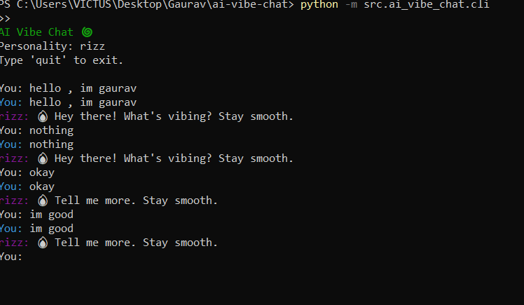

AI VIBE CHAT / Personality Bot (Python)

A local, themed chatbot that speaks in a sassy, fun, or custom personality (e.g., rizzbot, sarcastic). The codebase is intentionally a bit incomplete to encourage Hacktoberfest contributions.

Quickstart

1) Create a virtualenv and install deps
   - Windows PowerShell
     python -m venv .venv
     .\.venv\Scripts\Activate.ps1
     pip install -r requirements.txt

2) Run the CLI
     python -m ai_vibe_chat.cli --personality rizz

Features (Current)

- Minimal pluggable architecture: Provider + Personality → Engine → CLI
- Personalities: rizz, sarcastic (basic transformation)
- Local rules provider: naive rule-based response generator

Intentionally Incomplete (Great First Issues)

- Conversation memory
  - Store previous turns and use them for context.
  - Add a `--memory` flag and persistence (JSON file or simple DB).

- Better response generation
  - Improve `LocalRulesProvider` with pattern matching, templates, and small talk.
  - Add temperature/creativity controls.

- Personality system
  - Formalize a registry; discover personalities dynamically.
  - Add more personalities (e.g., wholesome, pirate, yoda, mentor, roast master).

- Provider interfaces
  - Add a `LocalLLMProvider` interface (even if stubbed) to swap in future models.
  - Add a `--provider` CLI flag and wire it to the engine.

- TTS/Speech I/O (optional)
  - Text-to-speech for replies and speech-to-text for input.
  - Add a `--speak` flag and configurable voices.

- UX polish
  - Colored output per speaker, timestamps, and typing indicator.
  - Add `/help`, `/clear`, `/save`, `/load` commands.

How It Works

- `engine.Engine` orchestrates personalities and providers.
- `personalities` decorate prompts/outputs with a style.
- `providers` generate responses (currently simple rules).
- `cli` provides a REPL with personality selection.

Repository Layout

ai-vibe-chat/
  requirements.txt
  README.md
  src/
    ai_vibe_chat/
      __init__.py
      cli.py
      engine.py
      personalities/
        __init__.py
        base.py
        rizz.py
        sarcastic.py
      providers/
        __init__.py
        base.py
        local_rules.py

Install in Editable Mode (optional)

  pip install -e .

CLI Usage

  python -m ai_vibe_chat.cli --personality rizz

Examples

  You: give me gym motivation
  Bot: Bro, those weights aren’t gonna lift themselves. One more set. Own it.

  You: explain recursion simply
  Bot: Think mirrors facing mirrors. A thing that uses a smaller version of itself.

Contributing Guidelines (Hacktoberfest)

1) Pick an issue labeled good-first-issue or help-wanted
2) Create a feature branch
3) Add tests where reasonable
4) Keep PRs focused and small
5) Describe your change and how to test it

Open Task Ideas

- Implement conversation memory with a pluggable store
- Add personality discovery + `--list-personalities`
- Improve rule engine: intents, entities, templated responses
- Add `/help`, `/clear`, `/save`, `/load` commands to CLI
- Add colorized output and better formatting
- Add simple config file support (YAML/TOML)
- Add optional TTS output

License

MIT

